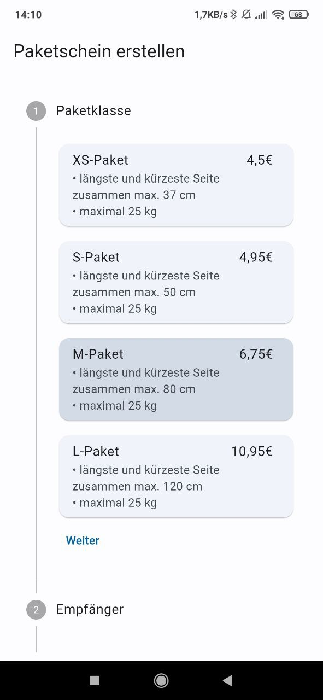
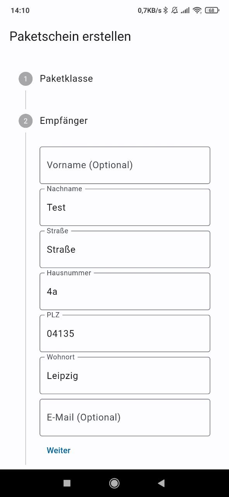
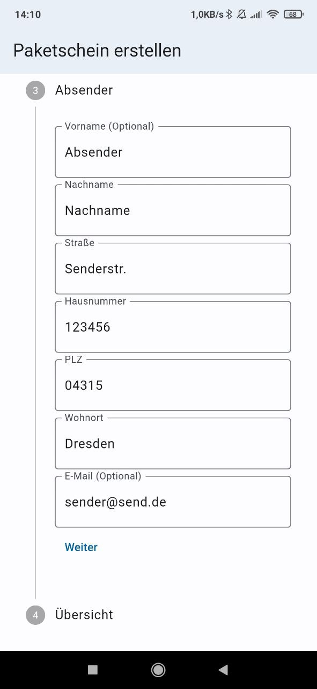
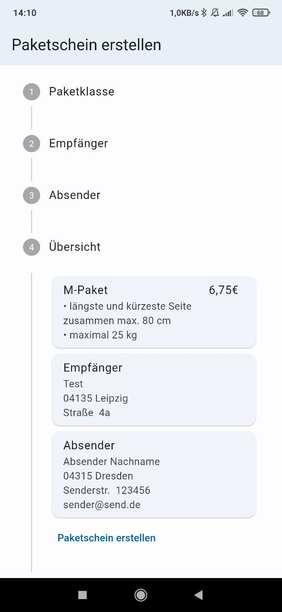
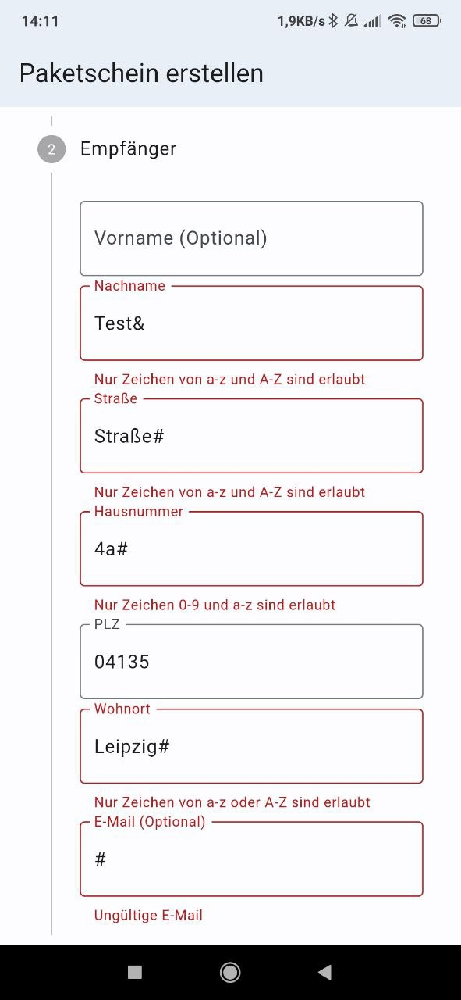

# dev-challenge


## How to Use

Go to the project root and run the following command in the console to get the required dependencies:
```
flutter pub get 
```

Execute the following command to generate files:

```
dart run build_runner build --delete-conflicting-outputs
```

Use the watch command to keep the source code synced automatically:

```
dart run build_runner watch --delete-conflicting-outputs
```

## Screenshots





